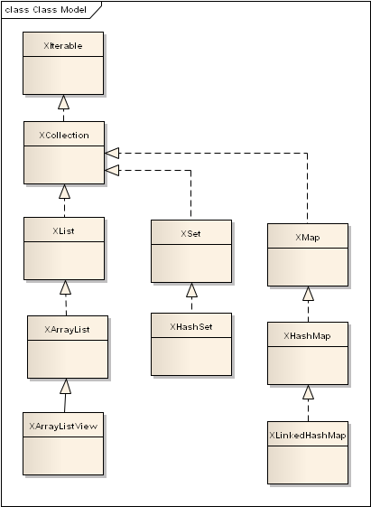
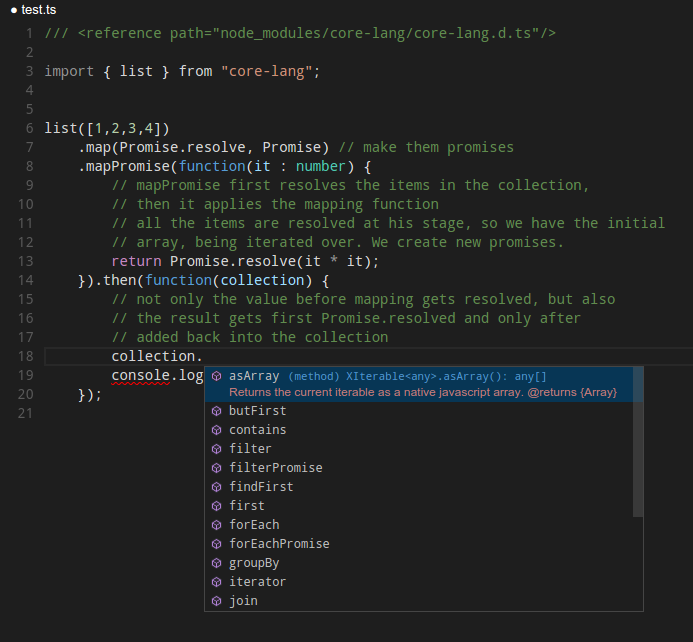

# core-lang

Classes that should be in the JavaScript language itself. The collections have a rich API to
work with the data, full promises support, [well written documentation](https://github.com/bmustiata/core-lang/blob/master/src/main/core/Iterable.ts) and TypeScript definitions.

## Usage

Available classes:



## Collections

All collections inherit from XIterable. It returns an iterator and offers the classic Array methods of iteration,
also filter, map/reduce, etc. with the same signature.

In addition some methods are added (some of them inspired from groovy) to make chaining more easier (such as `groupBy`,
`transform`, `first` or `butFirst`).

Last but not least the collections have full `Promise`s support, and allow processing of their content using the `Promise`
API. For example, assuming that our collection contains promises, we can:

```javascript
list([1,2,3,4])
    .map(Promise.resolve, Promise) // make them promises
    .mapPromise(function(it) {
        // mapPromise first resolves the items in the collection,
        // then it applies the mapping function
        // all the items are resolved at his stage, so we have the initial
        // array, being iterated over. We create new promises.
        return Promise.resolve(it * it);
    }).then(function(collection) {
        // not only the value before mapping gets resolved, but also
        // the result gets first Promise.resolved and only after
        // added back into the collection
        assert.equal([1,4,9,16], collection.asArray());
    });
```

Furthermore since the collections are written in TypeScript, the module embeds the .d.ts file, so you get full
autocomplete and documentation support from the IDE (pictured Visual Studio Code)



## Extras

### format

`format`is a very simple string formatting method that uses positional parameters in the spirit of .NET:

```javascript
var format = require("core-lang/lib/stringUtils").format;

var text = format("{0} {1}!", "Hello", "World");

console.log(text); // will output 'Hello World!'
```

### reflect

`reflect`, as its name implies, offers some utility methods that allow reflection operations on objects and functions.

Here is a sample of reflect displaying its own API:

```javascript
var reflect = require("core-lang/lib/reflect"),
    format = require("core-lang/lib/stringUtils").format;

// reflect displaying its own API
reflect.functions(reflect).forEach(function(method) {
    console.log(format("function {0}({1});",
        method.key,
        reflect.argumentNames(method.value)
            .join(", ")
        ));
});
```

This will output:

```text
function functionName(f);
function functions(obj);
function argumentNames(f);
function create(clazz, args);
function invoke(f, args);
```

## ChangeLog

* v.1.1.0  2015-09-10  Exported the reflect methods, and string format.
* v.1.0.1  2015-09-05  Added a bunch of mocha tests. (unit test)
* v.1.0.0  2015-08-31  Initial release.

